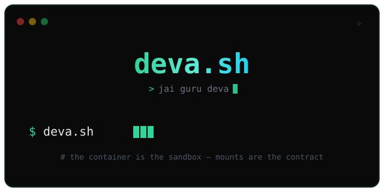

English | [简体中文](README.zh-CN.md)



[](https://github.com/thevibeworks/deva/actions/workflows/ci.yml)
[](https://github.com/thevibeworks/deva/releases)
[](https://docs.deva.sh)
[](LICENSE)

Run Claude Code, Codex, Gemini, Grok, and Kimi inside Docker without pretending the agents' own permission prompts are the thing keeping you safe.

The core, in four lines:

- The container is the sandbox. All five agents run inside it with their built-in permission systems disabled (`claude --dangerously-skip-permissions`, `codex --dangerously-bypass-approvals-and-sandbox`, `gemini --yolo`, `grok --always-approve`, `kimi --yolo`). Isolation comes from Docker, not permission theater.
- Mounts are the contract. Nothing crosses the host boundary except what you explicitly mount. No mystery behavior.
- One warm persistent container per project, shared by all five agents. Packages, build caches, and scratch state stay warm instead of being rebuilt every run.
- It's a bash script, not a framework.

## Quick Start

60 seconds:

```bash
curl -fsSL https://raw.githubusercontent.com/thevibeworks/deva/main/install.sh | bash

cd ~/work/my-project
deva.sh codex
```

If you already use these agents locally, deva auto-links their auth homes into per-agent config homes under `~/.config/deva/` by default. If not, first run asks you to authenticate inside the container.

## Common Commands

```bash
deva.sh                  # default agent is Claude
deva.sh codex            # same container, different agent
deva.sh gemini
deva.sh grok
deva.sh kimi

deva.sh claude --rm      # throwaway container
deva.sh claude --debug --dry-run   # inspect the docker run before trusting it
deva.sh shell            # shell into the project container
deva.sh ps               # list containers
deva.sh stop             # stop it
deva.sh --show-config    # read resolved config
```

## What This Is Not

- Not safety magic. Mounting `/var/run/docker.sock` is host root with extra steps — deva will tell you so. If you don't need Docker-in-Docker, use `--no-docker`.
- Mount your whole home read-write and hand the agent dangerous permissions, and the agent can touch your whole home. Amazing how that works.
- `--host-net` gives the container broad network visibility. Use it when you mean it.
- Not a general-purpose devcontainer platform.

The full security boundary is in [SECURITY.md](SECURITY.md).

## Images

Stable:

- `ghcr.io/thevibeworks/deva:latest`
- `ghcr.io/thevibeworks/deva:rust`
- `ghcr.io/thevibeworks/deva:cloak` (CloakBrowser stealth Chromium, headed; `deva.sh -p cloak`)

Nightly refresh: `ghcr.io/thevibeworks/deva:nightly`, `ghcr.io/thevibeworks/deva:nightly-rust`

## Docs

Everything lives at [docs.deva.sh](https://docs.deva.sh): quick start, authentication, how it works, advanced usage, troubleshooting, philosophy.

AI agents / LLMs: read [llms.txt](llms.txt) — the whole product in one fetch.

## License

MIT. See [LICENSE](LICENSE).
